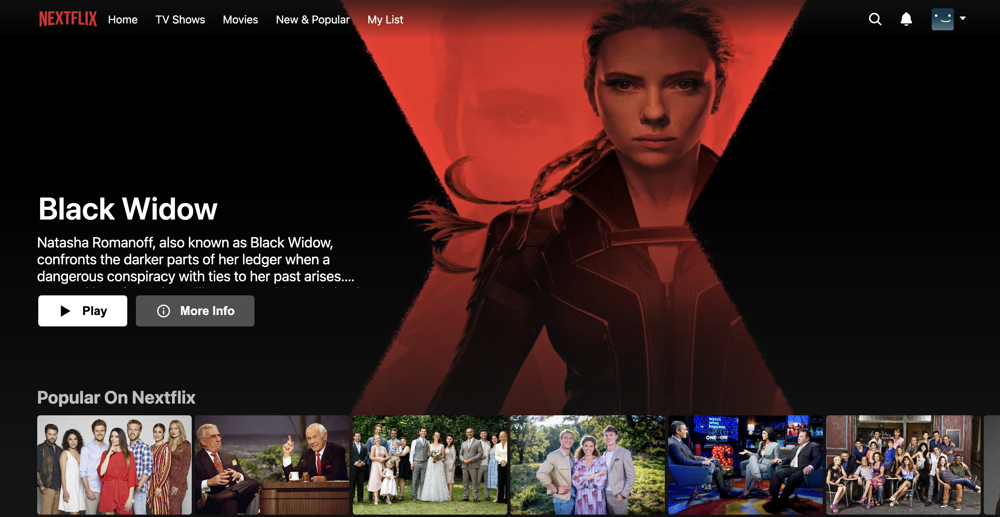
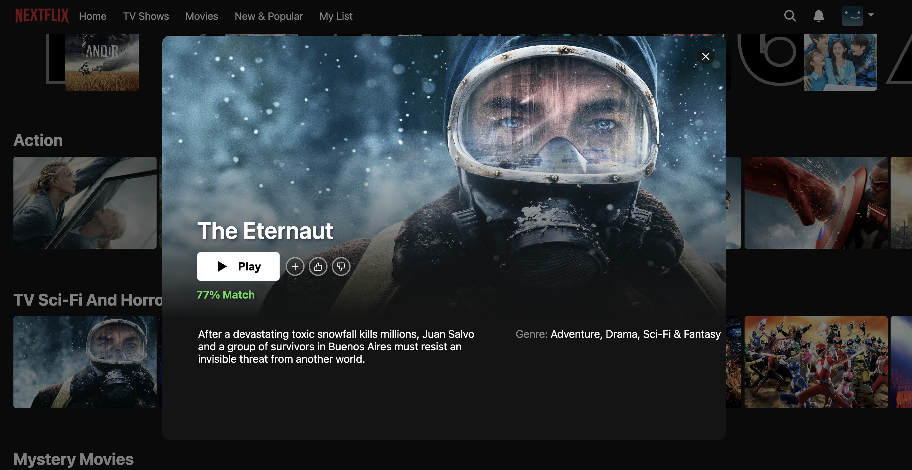

# 🎥 NETFLIX CLONE

A Netflix Clone built with [Next.js](https://nextjs.org/), [Typescript](https://www.typescriptlang.org/), and [Sass](https://sass-lang.com/), powered by the [TMDB API](https://www.themoviedb.org/). Experience seamless streaming, interactive content browsing, and dynamic movie information—all in one place, just like the Netflix app we know and love! 

Visit https://netflix-rouge-zeta.vercel.app/

## 🛠️ Tech Stack
* Frontend: Next.js, TypeScript, Sass
* Backend: TMDB API for movie data
* Styling: Sass (SCSS)

## 🚀 Features
* 🔍 Search and Browse – Find movies and TV shows with real-time search powered by the TMDB API.
* 🎞️ Dynamic Content Sliders – Explore popular, trending, and recommended content.
* 📽️ Content Details – View detailed information, trailers, and ratings.
* 💾 Responsive Design – Optimized for all screen sizes and devices.
* ⚡ Fast and Interactive – Built with Next.js for fast performance.

## 🖥️ Running the Project
This is a [Next.js](https://nextjs.org/) project bootstrapped with [`create-next-app`](https://github.com/vercel/next.js/tree/canary/packages/create-next-app).

 #### Install Dependencies
* `yarn install` or `npm install`

 #### Build the Project
* `yarn build`

 #### Run the Project
* `yarn start`

It runs the app in the development mode. 
Open [http://localhost:3000](http://localhost:3000) to view it in the browser. 

## 📸 Screenshots

### Landing Page

### Content Sliders

### Content Information
